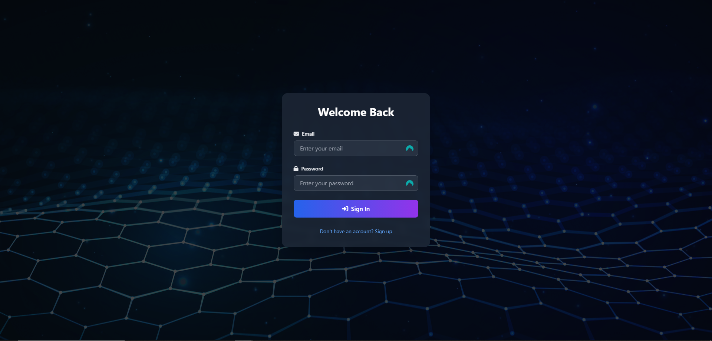
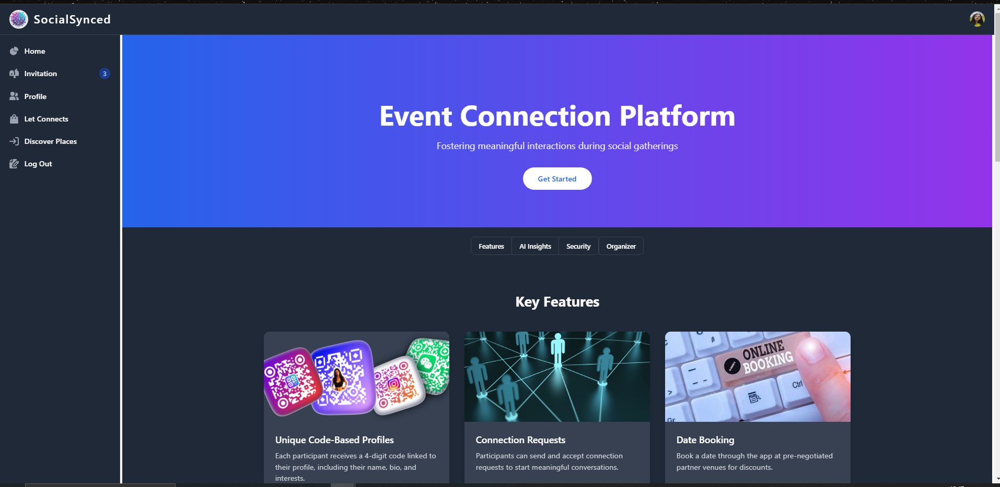
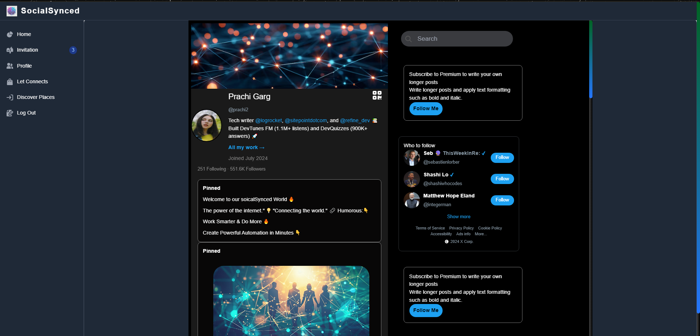
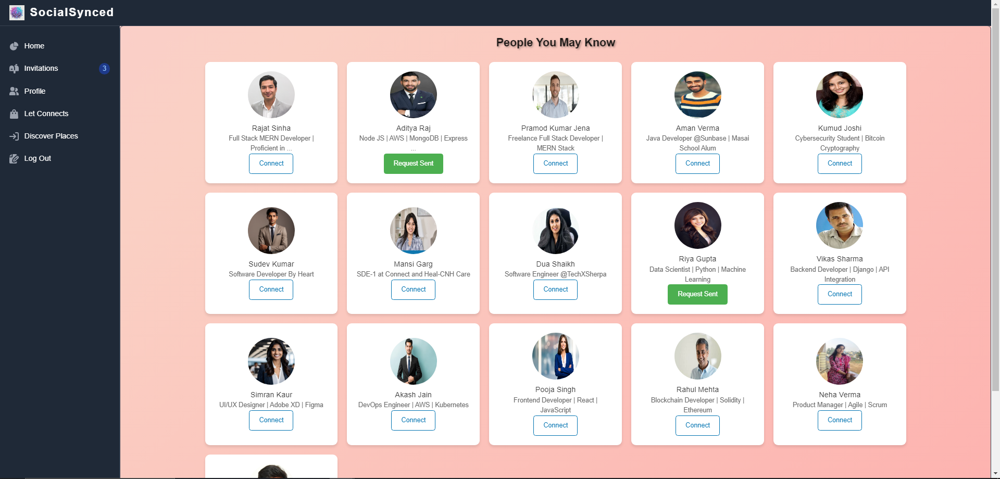
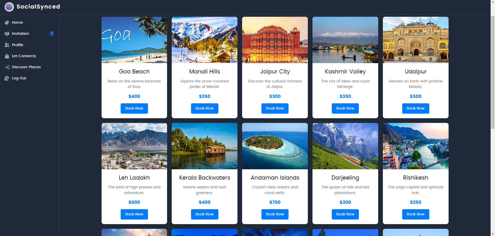

# SocialSynced 🤝

[](https://4436-i4eo.vercel.app/)
[](https://opensource.org/licenses/MIT)

> Connect, Share, Experience - Your Perfect Social Planning Platform

SocialSynced is an innovative web platform designed to bring people together through shared interests and help them plan memorable experiences. Whether you're looking to expand your professional network, make new friends, or find that special someone, SocialSynced provides the perfect space for meaningful connections.

## 🚀 Quick Start

**Demo Credentials:**

- Email: prachi1@gmail.com
- Password: secret0000

## ✨ Features

### Core Functionality

- **🔐 Secure Authentication** - Robust login and registration system
- **👤 Profile Management** - Personalized user profiles
- **🔍 Interest Matching** - Connect with like-minded individuals
- **📅 Event Planning** - Seamless date and meetup organization
- **🌐 Social Networking** - Expand your social circle
- **📍 Smart Recommendations** - Discover perfect meeting spots

## 🏗️ Project Structure

### Backend Architecture

```
backend/
├── src/
│   ├── config/
│   │   └── database.js        # Database configuration
│   ├── controller/
│   │   └── auth.controller.js # Authentication logic
│   ├── middleware/
│   │   ├── auth.js           # Auth middleware
│   │   └── cloudinary.service.js
│   ├── models/
│   │   ├── Profile.js        # Profile schema
│   │   └── User.js           # User schema
│   └── routes/
│       ├── auth.route.js     # Auth routes
│       └── profile.route.js  # Profile routes
├── app.js                    # Entry point
└── vercel.json              # Deployment config
```

### Frontend Structure

```
frontend/
├── assets/
│   └── logo.jpg            # Brand assets
├── pages/
│   ├── connection.html     # Connection features
│   ├── home.html          # Homepage
│   ├── network.html       # Network view
│   ├── places.html        # Location discovery
│   └── profile.html       # User profiles
├── script/
│   ├── Scanner.js         # Scanning utility
│   ├── auth.js           # Authentication
│   └── condition.js      # Business logic
└── styles/               # Styling assets
```

## 🛠️ Local Development Setup

### Prerequisites

- Node.js (Latest LTS version recommended)
- MongoDB instance
- Git

### Installation Steps

1. **Clone the repository**

   ```bash
   git clone https://github.com/syedamaan7733/4436.git
   cd 4436
   ```

2. **Set up the backend**

   ```bash
   cd backend
   npm install
   ```

3. **Launch the server**

   ```bash
   npm run dev
   ```

4. **Access the frontend**
   - Navigate to the `frontend` directory
   - Open `index.html` in your preferred browser

## 📸 Visual Overview

### Authentication



### Main Dashboard



### User Profiles



### Connection Management



### Discovery Feed



## 🤝 Contributing

We welcome contributions to make SocialSynced even better! Here's how you can help:

1. Fork the repository
2. Create your feature branch (`git checkout -b feature/AmazingFeature`)
3. Commit your changes (`git commit -m 'Add some AmazingFeature'`)
4. Push to the branch (`git push origin feature/AmazingFeature`)
5. Open a Pull Request

## 📄 License

This project is licensed under the MIT License - see the [LICENSE](LICENSE) file for details.

---

Built with ❤️ by the SocialSynced Team
